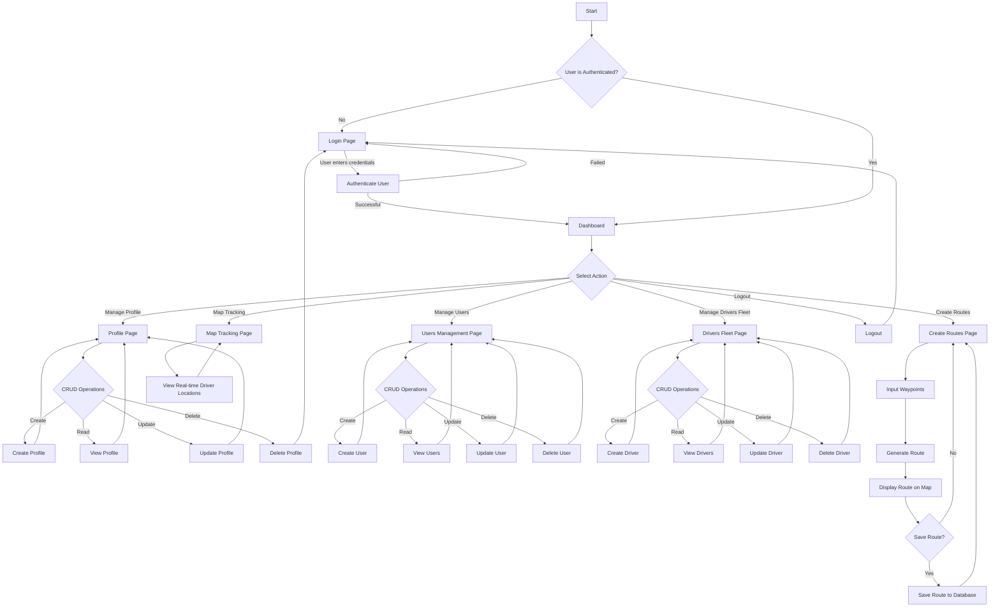

```mermaid
graph TD
    A[Start] --> B{User is Authenticated?};
    B -- No --> C[Login Page];
    C -- User enters credentials --> D[Authenticate User];
    D -- Successful --> E[Dashboard];
    D -- Failed --> C;

    B -- Yes --> E;

    E --> F{Select Action};
    F -- Manage Profile --> G[Profile Page];
    G --> H{CRUD Operations};
    H -- Create --> I[Create Profile];
    H -- Read --> J[View Profile];
    H -- Update --> K[Update Profile];
    H -- Delete --> L[Delete Profile];
    I --> G;
    J --> G;
    K --> G;
    L --> C;

    F -- Manage Users --> M[Users Management Page];
    M --> N{CRUD Operations};
    N -- Create --> O[Create User];
    N -- Read --> P[View Users];
    N -- Update --> Q[Update User];
    N -- Delete --> R[Delete User];
    O --> M;
    P --> M;
    Q --> M;
    R --> M;

    F -- Manage Drivers Fleet --> S[Drivers Fleet Page];
    S --> T{CRUD Operations};
    T -- Create --> U[Create Driver];
    T -- Read --> V[View Drivers];
    T -- Update --> W[Update Driver];
    T -- Delete --> X[Delete Driver];
    U --> S;
    V --> S;
    W --> S;
    X --> S;

    F -- Map Tracking --> Y[Map Tracking Page];
    Y --> Z[View Real-time Driver Locations];
    Z --> Y;

    F -- Create Routes --> AA[Create Routes Page];
    AA --> BB[Input Waypoints];
    BB --> CC[Generate Route];
    CC --> DD[Display Route on Map];
    DD --> EE{Save Route?};
    EE -- Yes --> FF[Save Route to Database];
    EE -- No --> AA;
    FF --> AA;

    F -- Logout --> GG[Logout];
    GG --> C;
```
